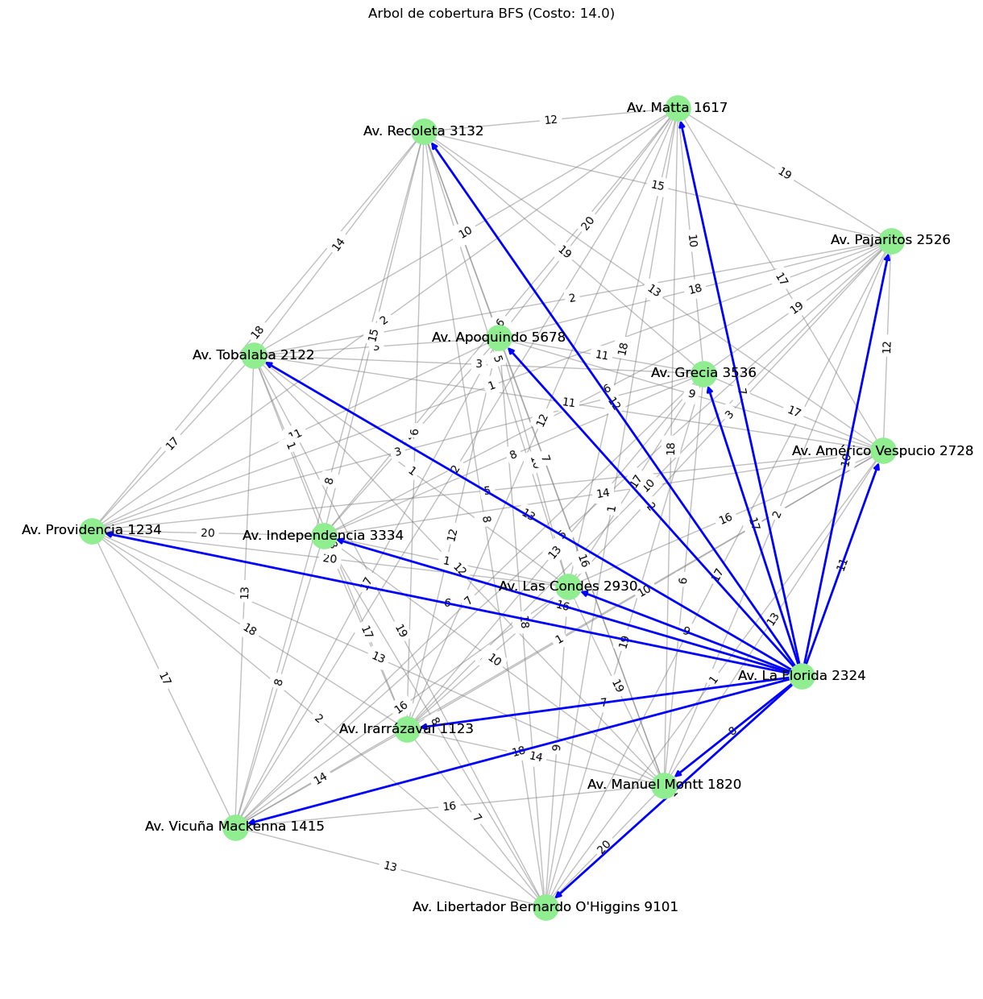
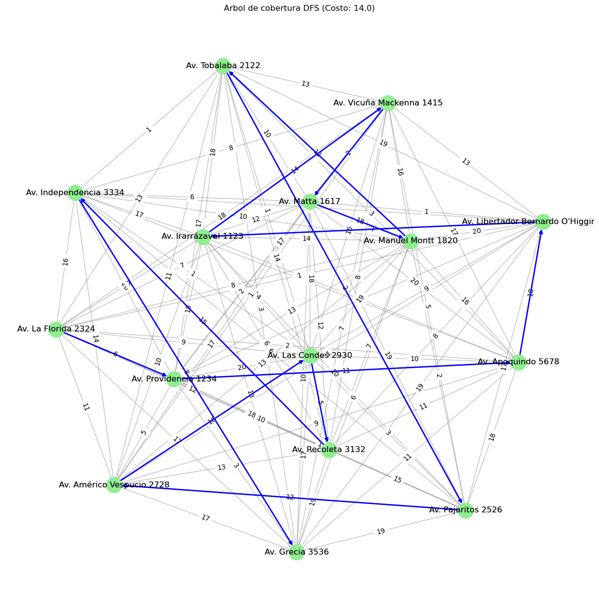

# Tarea_1_Heuristica
Tarea sobre Arboles de cobertura BFS y DFS en ramo TECNICAS DE BUSQUEDA Y HEURISTICAS del MIA UAI 2024

* Arbol de cobertura de prueba con direccion aleatoria en santiago tipo BFS

*Arbol de cobertura de prueba con direccion aleatoria en santiago tipo DFS
!
